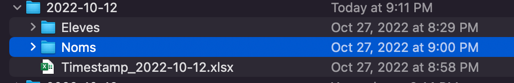

# PhotosBrindamour

Outil permettant de traiter les photos scolaires et de les préparer pour l'importation dans sytist.
On catégorise normalement les photo prises par date. Chaque date a son dossier qui contient le dossier timestamp et un
dossier Eleves avec toutes les photos d'élèves.
Pour les photos scolaires, on a aussi un dossier "Noms" avec les photos du nom des élèves.

1. Pour chaque dossier de date
   1. Quand on a le dossier "Noms" -> L'outil utilise une librairie d'extraction de texte pour matcher le nom de l'élève
      avec le timestamp. L'avantage de cette méthode est qu'on ne dépend pas du timing du scan du fichier timestamp
      1. Exécuter l'outil avec l'option -v.
      2. On obtient un dossier NamesValidation.
      3. On passe à travers chaque photo et on valide que le nom de l'élève dans la photo équivaut au nom de l'élève
         dans
         le nom de fichier.
      4. Si ça ne concorde pas:
         1. Il peut manquer un nom dans le fichier timestamp, on l'ajoute au bon endroit et on réessaie
         2. Il peut manquer une photo de nom dans "Noms". On peut prendre une photo de l'élève sans son nom et réessayer
      5. Quand tout concorde, on exécute avec l'option -e, on valide quelques fichiers pour voir s'il s'agit du bon
         élève
   2. Quand on n'a pas le dossier "Noms" - Méthode traditionnelle, on regarde la date de la photo et on trouve une
      correspondance dans le fichier timestamp
      1. Exécuter l'outil avec les options -e -x. Un dossier Upload sera créé
      2. Valider le contenu de chaque dossier d'élève dans le dossier Upload. S'assurer qu'un dossier élève ne contient
         qu'un seul élève et que le nom du fichier concorde avec l'élève
         1. Dans le cas où il y a des erreurs, on doit ajuster l'heure de début et de fin dans le fichier timestamp en
            modifiant la colonne Timeshift
         2. Si un élève n'est pas répertorié (codes 9xxxxxx), il faut créer l'entrée pour l'élève dans l'onglet 2.
            fiches élèves avec toutes les infos nécessaires
            1. Nom
            2. Numéro de fiche
            3. Groupe
         3. Quand tout concorde, on ré exécute avec l'option -e -x et on valide
2. À la racine, où il y a le fichier timestamp "MASTER", créer un dossier "ToUpload", y mettre tous les dossiers
   contenus dans chaque dossier "Upload" de chaque dossier date, afin d'avoir un dossier contenant toutes les photos des
   élèves
3. À partir de la racine, exécuter l'option -p et valider que tous les élèves ont au moins 3 poses.
4. Si tout est ok, copier les dossiers "classe" dans des sous-dossiers sur ftp sous /sy-upload/
5. Exporter pour les photos pour GPI avec l'option -s